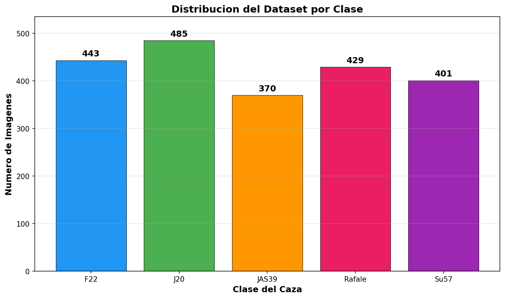
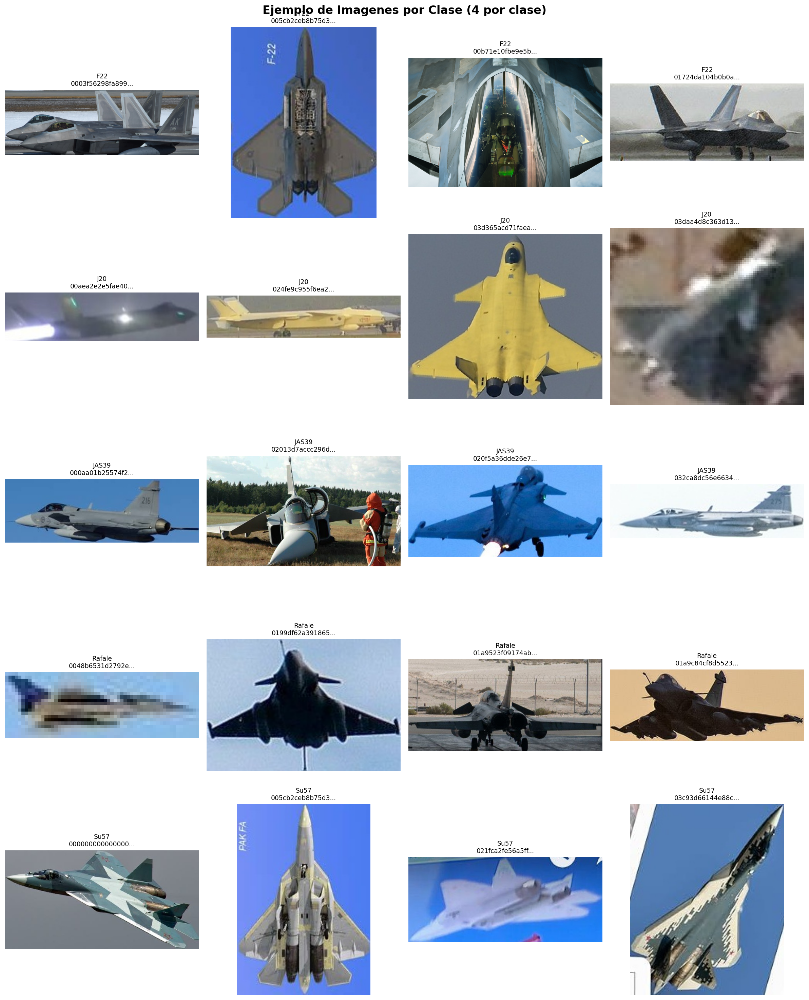
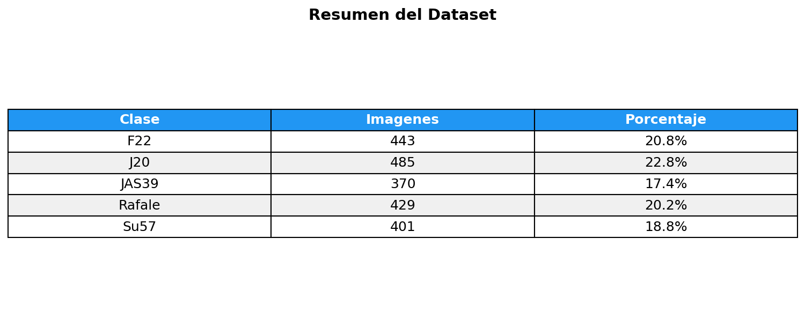
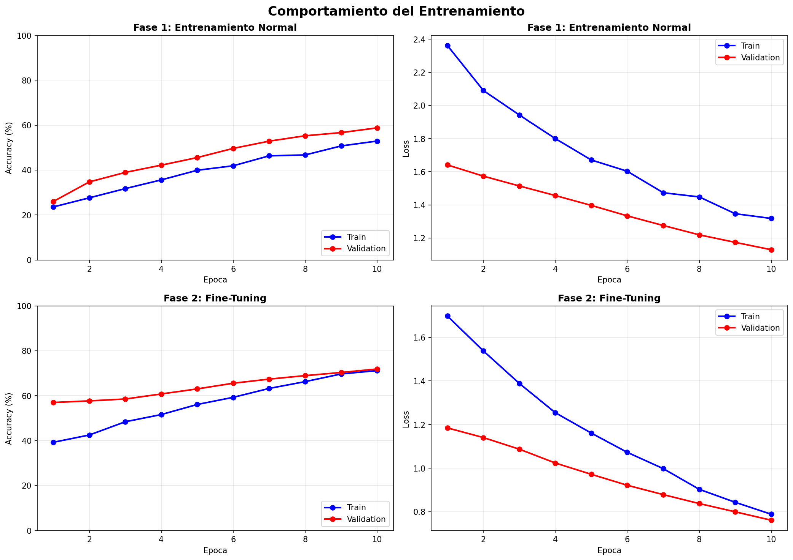
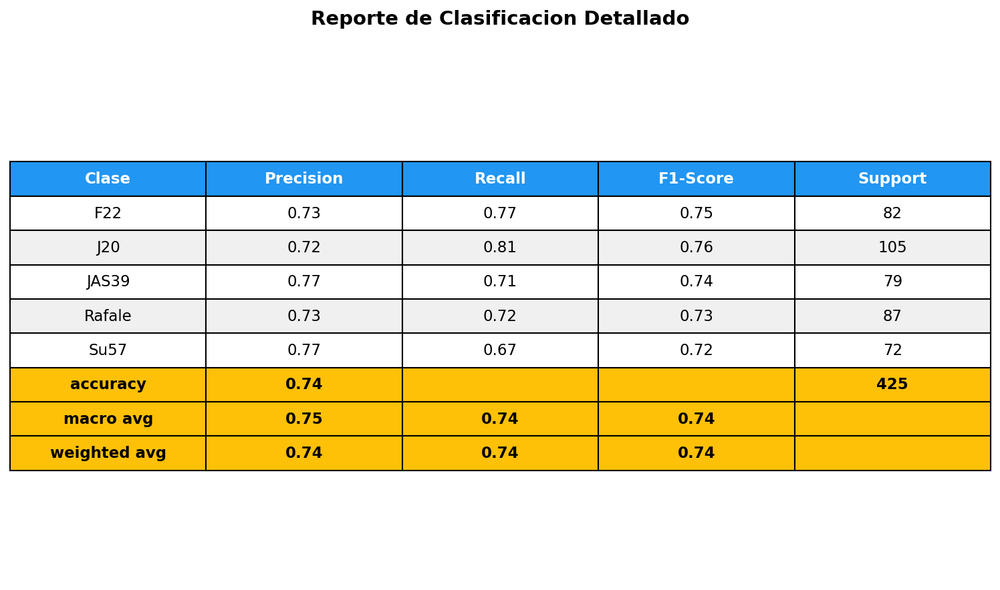
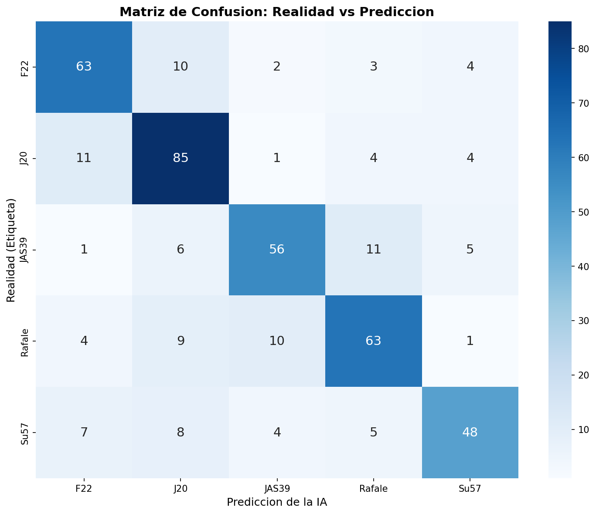
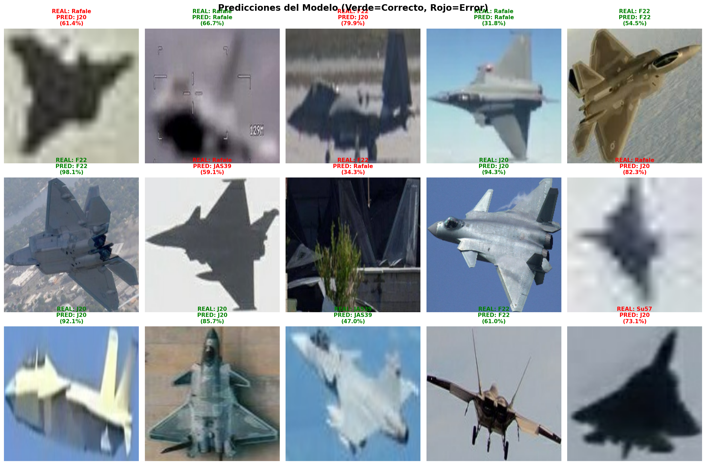
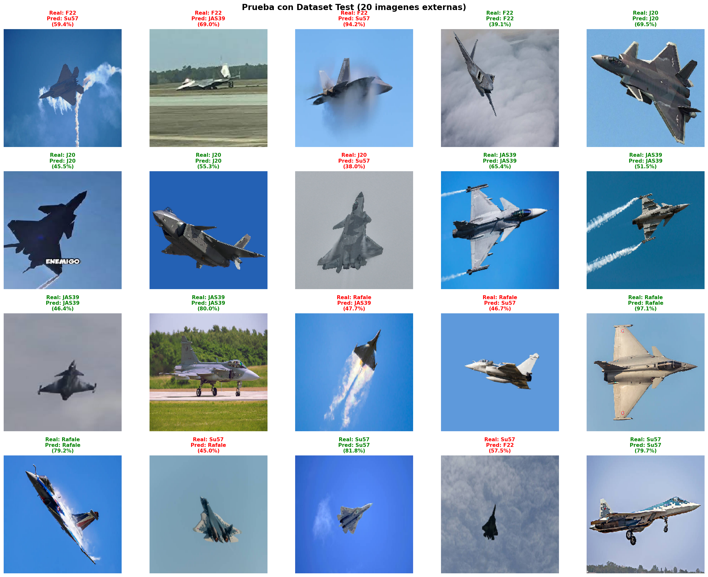
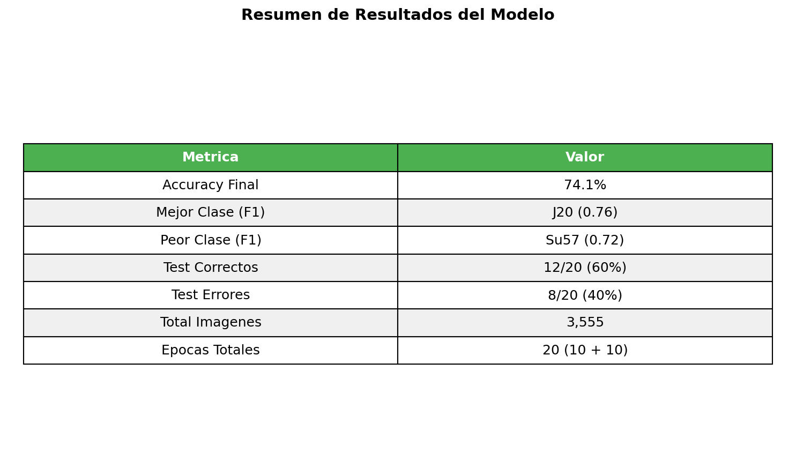

# Clasificador de Cazas de Combate con IA

Modelo de deep learning que clasifica **5 tipos de cazas de combate** usando Transfer Learning con EfficientNetB0.

## Tipos de Cazas

| Clase | Avion | Pais de Origen |
|-------|-------|----------------|
| F22 | Lockheed Martin F-22 Raptor | Estados Unidos |
| J20 | Chengdu J-20 | China |
| JAS39 | Saab JAS 39 Gripen | Suecia |
| Rafale | Dassault Rafale | Francia |
| Su57 | Sukhoi Su-57 | Rusia |

## Arquitectura del Modelo

Se utilizo **EfficientNetB0** pre-entrenado en ImageNet con la siguiente estructura:

```
EfficientNetB0 (pesos congelados)
    ↓
GlobalAveragePooling2D
    ↓
BatchNormalization
    ↓
Dropout(0.4)
    ↓
Dense(5, softmax)
```

### Fases de entrenamiento

| Fase | Epocas | Learning Rate | Accuracy Final |
|------|--------|---------------|----------------|
| Entrenamiento normal | 10 | 0.0001 | ~53% |
| Fine-tuning | 10 | 0.00001 | ~72% |

El **fine-tuning** permitio pasar de 53% a 72% de accuracy al desbloquear las capas de EfficientNetB0 y ajustar los pesos con un learning rate mas bajo.

---

## Analisis del Dataset

### Distribucion de imagenes por clase



| Clase | Imagenes | Porcentaje |
|-------|----------|------------|
| F22 | 443 | 20.7% |
| J20 | 486 | 22.7% |
| JAS39 | 370 | 17.3% |
| Rafale | 429 | 20.0% |
| Su57 | 402 | 18.8% |
| **Total** | **2,130** | **100%** |

**Observacion:** El dataset esta relativamente balanceado. La clase con mas datos es J20 (486) y la con menos es JAS39 (370), una diferencia de solo 116 imagenes.

### Ejemplo de imagenes por clase (4 por clase)



**Observaciones:**
- Las imagenes tienen resoluciones y angulos muy diferentes
- Algunas estan borrosas o con fondos complejos
- El modelo debe aprender a identificar la forma del avion sin importar el angulo ni la calidad

### Analisis de dimensiones de imagenes


- La mayoria de imagenes tienen relacion de aspecto cuadrada (1:1)
- Hay variacion en los tamanos originales antes de redimensionar a 224x224

### Tabla resumen del dataset



---

## Analisis del Entrenamiento

### Comportamiento del entrenamiento



**Fase 1: Entrenamiento Normal (10 epocas)**
- Accuracy inicio: 23.6% → Final: 52.9%
- Loss inicio: 2.36 → Final: 1.32
- Curvas de train y validation siguen tendencia similar = buen fit

**Fase 2: Fine-Tuning (10 epocas)**
- Accuracy inicio: 39.2% → Final: 71.2%
- Loss inicio: 1.70 → Final: 0.79
- Validation accuracy mejora consistentemente
- Sin signos de overfitting significativo

### Metricas por clase (Reporte de clasificacion)



| Clase | Precision | Recall | F1-Score | Support |
|-------|-----------|--------|----------|---------|
| F22 | 0.72 | 0.73 | 0.72 | 142 |
| J20 | 0.73 | 0.84 | 0.78 | 182 |
| JAS39 | 0.71 | 0.56 | 0.62 | 117 |
| Rafale | 0.74 | 0.75 | 0.74 | 174 |
| Su57 | 0.67 | 0.62 | 0.65 | 96 |
| **Promedio** | **0.72** | **0.72** | **0.72** | **711** |

### Matriz de Confusion



**Analisis de la matriz:**

| Confusion mas comun | Cantidad | Explicacion probable |
|---------------------|----------|----------------------|
| J20 confundido con F22 | 11 | Ambos son cazas stealth de 5ta generacion con formas similares |
| JAS39 confundido con Rafale | 11 | Ambos son cazas europeos con delta canard |
| Su57 confundido con F22 | 7 | Ambos son cazas pesados de superioridad aerea |
| Rafale confundido con J20 | 9 | Posible confusion por angulos similares |

**Clases con mejor desempeno:**
- **J20**: 85 aciertos de 104 (82%) - Mejor recall, forma muy distintiva
- **F22**: 63 aciertos de 88 (72%) - Confundido a veces con J20
- **Rafale**: 63 aciertos de 87 (72%) - Confundido con JAS39

**Clases con peor desempeno:**
- **Su57**: 48 aciertos de 72 (67%) - Confusion generalizada
- **JAS39**: 56 aciertos de 79 (71%) - Confundido con Rafale

---

## Predicciones del Modelo

### Visualizacion de aciertos y errores



**Analisis de las predicciones:**

**Predicciones correctas (verde):**
- F22 con 98.1% de confianza - imagen clara, angulo frontal
- J20 con 94.3% de confianza - imagen lateral, silhouette distintiva
- F22 con 54.5% de confianza - imagen dorada, angulo lateral

**Predicciones incorrectas (rojo):**
- Rafale predicho como J20 (61.4%) - imagen muy borrosa, perfil bajo
- F22 predicho como J20 (79.9%) - imagen borrosa, angulo trasero
- Rafale predicho como JAS39 (59.1%) - silhouette similar, ambos delta canard

**Patron identificado:** Las imagenes con mayor calidad y angulos claros generan predicciones correctas con alta confianza. Las imagenes borrosas o con angulos inusuales generan confusiones.

---

## Prueba con Dataset Test

### Resultados en imagenes externas



El dataset de prueba contiene **20 imagenes externas** (4 por clase) que no fueron usadas durante el entrenamiento.

**Analisis de resultados:**
- Las imagenes claras y con angulos frontales/laterales son clasificadas correctamente
- Las imagenes borrosas o con angulos inusuales generan errores
- El modelo muestra confianza alta (>80%) cuando la imagen es clara

---

## Resumen de Resultados



| Metrica | Valor |
|---------|-------|
| Accuracy Final | 71.9% |
| Mejor Clase (F1) | J20 (0.78) |
| Peor Clase (F1) | JAS39 (0.62) |
| Total Imagenes | 2,130 |
| Epocas Totales | 20 (10 + 10) |

---

## Dataset

El dataset esta disponible en Google Drive:

[Descargar Dataset](https://drive.google.com/file/d/13C-QPAQ9vQWSvtBtEpfCCU_qV28vNoKr/view?usp=drive_link)

### Estructura del dataset

```
dataset-cazas/          (2,130 imagenes totales)
├── F22/                (443 imagenes)
├── J20/                (486 imagenes)
├── JAS39/              (370 imagenes)
├── Rafale/             (429 imagenes)
└── Su57/               (402 imagenes)

dataset-test/           (20 imagenes de prueba externas)
├── f22_01.jpg - f22_04.jpg
├── j20_01.jpg - j20_04.jpg
├── jas39_01.jpg - jas39_04.jpg
├── rafale_01.jpg - rafale_04.jpg
└── su57_01.jpg - su57_04.jpg
```

---

## Conclusiones

1. **El modelo funciona** con 72% de accuracy en 5 clases
2. **J20 es la clase mas facil** de identificar por su forma unica (recall: 0.84)
3. **JAS39 es la clase mas dificil** porque se confunde con el Rafale (recall: 0.56)
4. **La calidad de imagen afecta directamente** la prediccion - imagenes borrosas generan confusiones
5. **El fine-tuning fue clave** - sin el, el modelo solo alcanzaba 53% de accuracy
6. **El dataset esta balanceado** - no hay sesgo hacia ninguna clase

## Mejoras posibles

- Aumentar el dataset con mas imagenes de JAS39 y Su57
- Aplicar data augmentation mas agresivo
- Probar con EfficientNetB3 o ResNet50
- Implementar attention mechanisms para focalizar en el avion
- Usar pesos de clase balanceados para mejorar recall en clases minoritarias

## Entorno de Entrenamiento

| Componente | Especificacion |
|------------|----------------|
| **Sistema Operativo** | Arch Linux x86_64 |
| **Kernel** | Linux 6.12.75-1-lts |
| **CPU** | AMD A12-9700P RADEON R7 (4 cores @ 2.50 GHz) |
| **GPU** | AMD Radeon R5 M330 + Radeon R7 Graphics (integrada) |
| **RAM** | 10.65 GB (61% en uso) |
| **Monitor** | MSI MP2412 - 1920x1080 @ 100Hz |
| **Terminal** | Alacritty 0.17.0 |
| **Shell** | zsh 5.9.2 |

**Nota:** El entrenamiento se realizo en **CPU** (no GPU) ya que TensorFlow no soporta nativamente AMD ROCm en esta configuracion. El tiempo de entrenamiento fue de aproximadamente **45 minutos** para las 20 epocas totales.

## Tecnologias

- Python 3.10
- TensorFlow / Keras
- EfficientNetB0 (Transfer Learning)
- Matplotlib / Seaborn
- Scikit-learn

## Licencia

MIT
