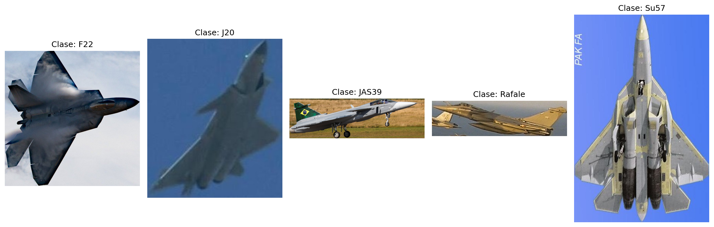
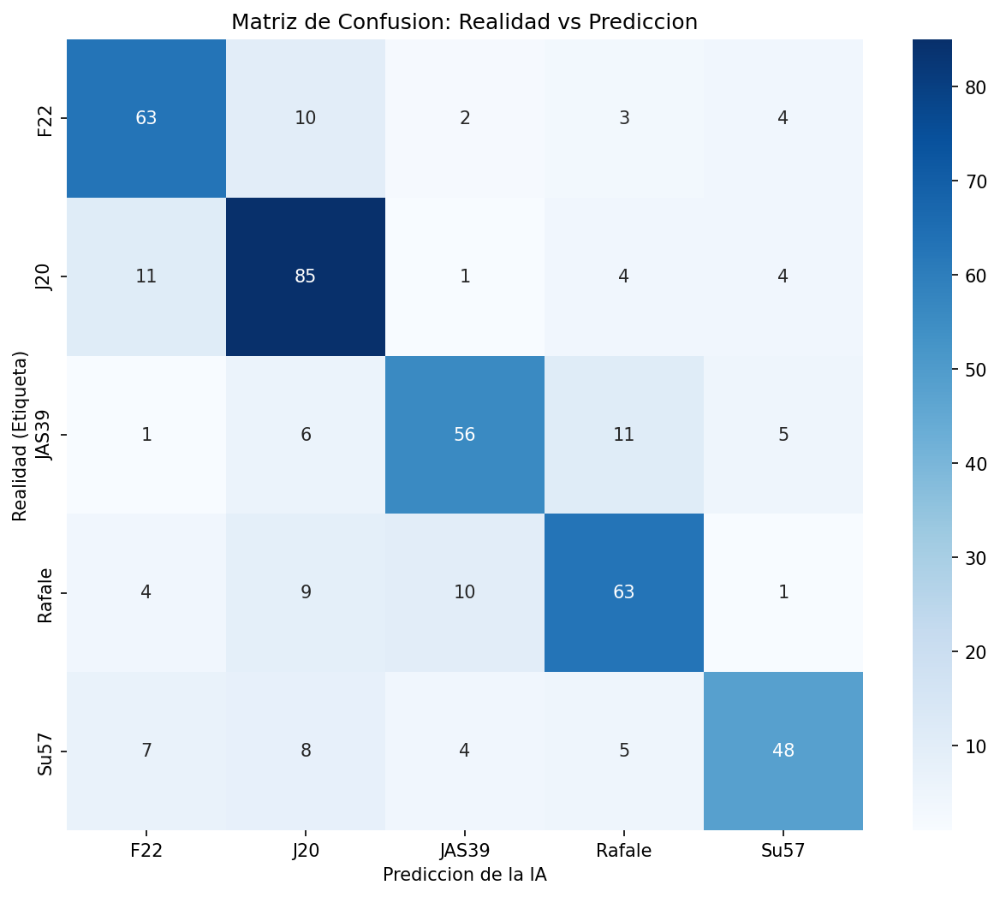
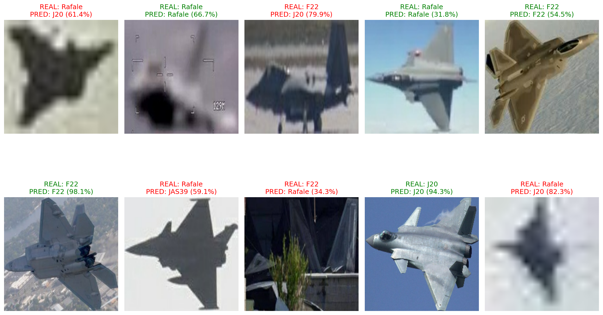

# Clasificador de Cazas de Combate con IA

Modelo de deep learning que clasifica **5 tipos de cazas de combate** usando Transfer Learning con EfficientNetB0.

## Tipos de Cazas

| Clase | Avion | Pais de Origen |
|-------|-------|----------------|
| F22 | Lockheed Martin F-22 Raptor | Estados Unidos |
| J20 | Chengdu J-20 | China |
| JAS39 | Saab JAS 39 Gripen | Suecia |
| Rafale | Dassault Rafale | Francia |
| Su57 | Sukhoi Su-57 | Rusia |

## Arquitectura del Modelo

Se utilizo **EfficientNetB0** pre-entrenado en ImageNet con la siguiente estructura:

```
EfficientNetB0 (pesos congelados)
    ↓
GlobalAveragePooling2D
    ↓
BatchNormalization
    ↓
Dropout(0.4)
    ↓
Dense(5, softmax)
```

### Fases de entrenamiento

| Fase | Epocas | Learning Rate | Accuracy Final |
|------|--------|---------------|----------------|
| Entrenamiento normal | 10 | 0.0001 | ~53% |
| Fine-tuning | 10 | 0.00001 | ~72% |

El **fine-tuning** permitio pasar de 53% a 72% de accuracy al desbloquear las capas de EfficientNetB0 y ajustar los pesos con un learning rate mas bajo.

## Analisis de Resultados

### Metricas por clase

| Clase | Precision | Recall | F1-Score | Support |
|-------|-----------|--------|----------|---------|
| F22 | 0.72 | 0.73 | 0.72 | 142 |
| J20 | 0.73 | 0.84 | 0.78 | 182 |
| JAS39 | 0.71 | 0.56 | 0.62 | 117 |
| Rafale | 0.74 | 0.75 | 0.74 | 174 |
| Su57 | 0.67 | 0.62 | 0.65 | 96 |
| **Promedio** | **0.72** | **0.72** | **0.72** | **711** |

### Ejemplo de imagenes por clase



**Observaciones:**
- Las imagenes tienen resoluciones y angulos muy diferentes
- Algunas estan borrosas o con fondos complejos
- El modelo debe aprender a identificar la forma del avion sin importar el angulo ni la calidad

### Matriz de Confusion



**Analisis de la matriz:**

| Confusion mas comun | Cantidad | Explicacion probable |
|---------------------|----------|----------------------|
| J20 confundido con F22 | 11 | Ambos son cazas stealth de 5ta generacion con formas similares |
| JAS39 confundido con Rafale | 11 | Ambos son cazas europeos con delta canard |
| Su57 confundido con F22 | 7 | Ambos son cazas pesados de superioridad aerea |
| Rafale confundido con J20 | 9 | Posible confusion por angulos similares |

**Clases con mejor desempeno:**
- **J20**: 85 aciertos de 104 (82%) - Mejor recall, forma muy distintiva
- **F22**: 63 aciertos de 88 (72%) - Confundido a veces con J20
- **Rafale**: 63 aciertos de 87 (72%) - Confundido con JAS39

**Clases con peor desempeno:**
- **Su57**: 48 aciertos de 72 (67%) - Confusion generalizada
- **JAS39**: 56 aciertos de 79 (71%) - Confundido con Rafale

### Predicciones del Modelo



**Analisis de las predicciones:**

**Predicciones correctas (verde):**
- F22 con 98.1% de confianza - imagen clara, angulo frontal
- J20 con 94.3% de confianza - imagen lateral, silhouette distintiva
- F22 con 54.5% de confianza - imagen dorada, angulo lateral

**Predicciones incorrectas (rojo):**
- Rafale predicho como J20 (61.4%) - imagen muy borrosa, perfil bajo
- F22 predicho como J20 (79.9%) - imagen borrosa, angulo trasero
- Rafale predicho como JAS39 (59.1%) - silhouette similar, ambos delta canard

**Patron identificado:** Las imagenes con mayor calidad y angulos claros generan predicciones correctas con alta confianza. Las imagenes borrosas o con angulos inusuales generan confusiones.

## Dataset

El dataset esta disponible en Google Drive:

[Descargar Dataset](https://drive.google.com/file/d/13C-QPAQ9vQWSvtBtEpfCCU_qV28vNoKr/view?usp=drive_link)

### Estructura del dataset

```
dataset-cazas/          (3555 imagenes totales)
├── F22/
├── J20/
├── JAS39/
├── Rafale/
└── Su57/

dataset-test/           (imagenes de prueba externas)
```

## Conclusiones

1. **El modelo funciona** con 72% de accuracy en 5 clases
2. **J20 es la clase mas facil** de identificar por su forma unica
3. **Su57 es la clase mas dificil** por tener menor representacion en el dataset y forma similar a otros cazas
4. **La calidad de imagen afecta directamente** la prediccion - imagenes borrosas generan confusiones
5. **El fine-tuning fue clave** - sin el, el modelo solo alcanzaba 53% de accuracy

## Mejoras posibles

- Aumentar el dataset con mas imagenes de Su57 y JAS39
- Aplicar data augmentation mas agresivo
- Probar con EfficientNetB3 o ResNet50
- Implementar attention mechanisms para focalizar en el avion

## Tecnologias

- Python 3.10
- TensorFlow / Keras
- EfficientNetB0 (Transfer Learning)
- Matplotlib / Seaborn
- Scikit-learn

## Licencia

MIT
